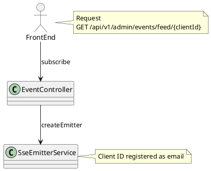
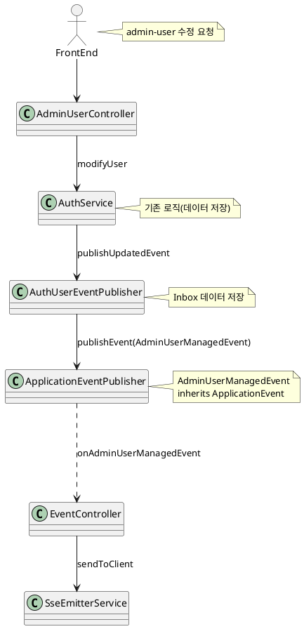
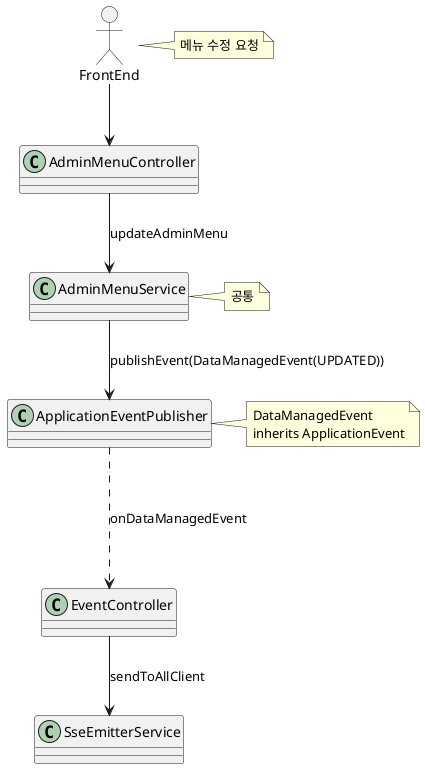
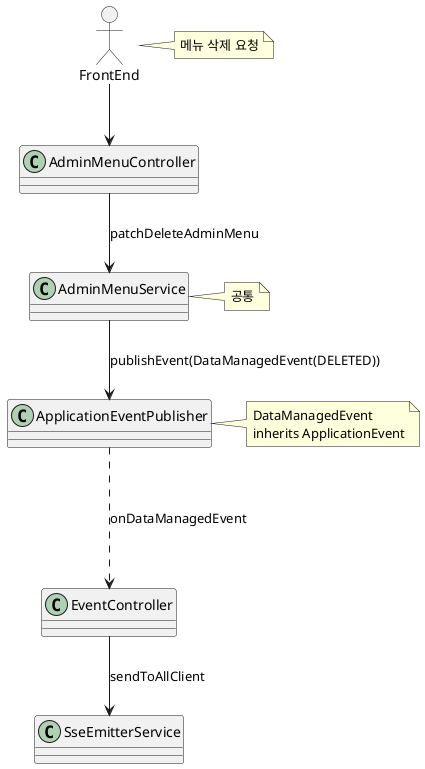

### 등록

```plantuml
@startuml
!define RECTANGLE class
allowmixing

actor FrontEnd
RECTANGLE EventController
RECTANGLE SseEmitterService

note right of FrontEnd : Request\nGET /api/v1/admin/events/feed/{clientId}
FrontEnd --> EventController : subscribe
EventController --> SseEmitterService : createEmitter

note right of SseEmitterService : Client ID registered as email
@enduml
```

image

### 사용자 수정

```plantuml
@startuml
!define RECTANGLE class
allowmixing

actor FrontEnd
RECTANGLE AdminUserController
RECTANGLE AuthService
RECTANGLE AuthUserEventPublisher
RECTANGLE EventController
RECTANGLE SseEmitterService
RECTANGLE ApplicationEventPublisher

note right of FrontEnd : admin-user 수정 요청
FrontEnd --> AdminUserController
AdminUserController --> AuthService : modifyUser

note right of AuthService : 기존 로직(데이터 저장)
AuthService --> AuthUserEventPublisher : publishUpdatedEvent

note right of AuthUserEventPublisher : Inbox 데이터 저장
AuthUserEventPublisher --> ApplicationEventPublisher : publishEvent(AdminUserManagedEvent)

note right of ApplicationEventPublisher : AdminUserManagedEvent\ninherits ApplicationEvent
ApplicationEventPublisher -.-> EventController : onAdminUserManagedEvent
EventController --> SseEmitterService : sendToClient
@enduml
@enduml
```

image

### 메뉴 등록

```plantuml
@startuml
!define RECTANGLE class
allowmixing

actor FrontEnd
RECTANGLE AdminMenuController
RECTANGLE AdminMenuService
RECTANGLE EventController
RECTANGLE SseEmitterService
RECTANGLE ApplicationEventPublisher

note right of FrontEnd : 메뉴 생성 요청
FrontEnd --> AdminMenuController
AdminMenuController --> AdminMenuService : createAdminMenu

note right of AdminMenuService : 공통
AdminMenuService --> ApplicationEventPublisher : publishEvent(DataManagedEvent(CREATED))
note right of ApplicationEventPublisher : DataManagedEvent\ninherits ApplicationEvent
ApplicationEventPublisher -.-> EventController : onDataManagedEvent
EventController --> SseEmitterService : sendToAllClient
@enduml
```

image

### 메뉴 수정

```plantuml
@startuml
!define RECTANGLE class
allowmixing

actor FrontEnd
RECTANGLE AdminMenuController
RECTANGLE AdminMenuService
RECTANGLE EventController
RECTANGLE SseEmitterService
RECTANGLE ApplicationEventPublisher

note right of FrontEnd : 메뉴 수정 요청
FrontEnd --> AdminMenuController
AdminMenuController --> AdminMenuService : updateAdminMenu

note right of AdminMenuService : 공통
AdminMenuService --> ApplicationEventPublisher : publishEvent(DataManagedEvent(UPDATED))
note right of ApplicationEventPublisher : DataManagedEvent\ninherits ApplicationEvent
ApplicationEventPublisher -.-> EventController : onDataManagedEvent
EventController --> SseEmitterService : sendToAllClient
@enduml
```

image

### 메뉴 삭제

```plantuml
@startuml
!define RECTANGLE class
allowmixing

actor FrontEnd
RECTANGLE AdminMenuController
RECTANGLE AdminMenuService
RECTANGLE EventController
RECTANGLE SseEmitterService
RECTANGLE ApplicationEventPublisher

note right of FrontEnd : 메뉴 삭제 요청
FrontEnd --> AdminMenuController
AdminMenuController --> AdminMenuService : patchDeleteAdminMenu

note right of AdminMenuService : 공통
AdminMenuService --> ApplicationEventPublisher : publishEvent(DataManagedEvent(DELETED))
note right of ApplicationEventPublisher : DataManagedEvent\ninherits ApplicationEvent
ApplicationEventPublisher -.-> EventController : onDataManagedEvent
EventController --> SseEmitterService : sendToAllClient
@enduml
```

image

